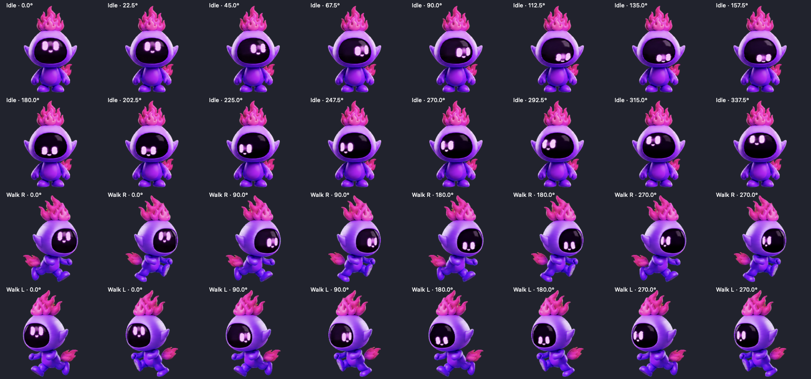

# Pet Terminal

**Make a desktop pet with a real terminal built in.** Download this repo, give it to ChatGPT or Codex on your Mac, and describe the companion you want.

[](https://github.com/BEXAI/Pet/actions/workflows/macos.yml)
[](LICENSE)

Violet Ember is the included example: a floating neon pet with mouse-tracking eyes, free roaming, and an attached terminal with a cyan outline, magenta text, and a fully transparent background.

**[Download source ZIP](https://github.com/BEXAI/Pet/archive/refs/heads/main.zip)** · **[Customize with ChatGPT](docs/CHATGPT-START-HERE.md)** · **[Artwork and theme guide](docs/CUSTOMIZE.md)**

## What you get

- A native macOS app written in Swift and AppKit.
- A pet that roams, can be dragged, and follows your mouse with its eyes.
- A real interactive zsh terminal powered by [SwiftTerm](https://github.com/migueldeicaza/SwiftTerm), with ANSI colors, command history within the session, copy/paste, resizing, and Ctrl-C.
- A terminal that follows the pet, or stays where you pin it. Hiding it keeps the shell running.
- JSON settings for the pet's name, artwork, gaze behavior, and terminal colors.
- Original sample artwork, an Xcode project, build/install/package scripts, native tests, and instructions for coding agents.

This is an independent desktop app. ChatGPT helps customize and build it; the app itself runs without ChatGPT, an API key, or an AI subscription. AI command-line tools you choose to launch in its terminal use their own installation and login.

## Make your own with ChatGPT

1. Download and unzip the repo, or clone it:

   ```sh
   git clone https://github.com/BEXAI/Pet.git
   cd Pet
   ```

2. On your Mac, create a local project in the ChatGPT desktop app and attach the downloaded `Pet` folder. Start a Work chat with **Work locally** selected. A local project supplies folder access; an ordinary uploaded ChatGPT project does not automatically provide access to that folder. See [official local-project instructions](https://learn.chatgpt.com/docs/projects) and [Work setup](https://learn.chatgpt.com/docs/get-started-with-work).
3. Paste this prompt, replacing the bracketed description:

   ```text
   Use this repository to make my own macOS desktop pet with a real terminal.
   Read AGENTS.md and docs/CHATGPT-START-HERE.md first.

   My pet: [name, appearance, personality, and any reference artwork].
   Terminal: [border color, text color, and background transparency].

   Keep roaming, dragging, pinning, mouse tracking, and the working terminal.
   Adapt the artwork and gaze mode to my character. Build and test on this Mac,
   fix any errors, and prepare an installable app and a source ZIP.
   Use the included scripts and preserve any active terminal sessions.
   ```

The longer [starter prompt](docs/CHATGPT-START-HERE.md) explains how to work with reference images, request missing context, and verify the result. You can also open this folder in Codex or run Codex CLI from it. ChatGPT can help edit source elsewhere, but native building and installation need a Mac with Xcode.

## Run the included pet

**Build requirements:** a Mac with full **Xcode 26.1 or newer**, opened once to complete its setup. Command Line Tools alone are insufficient. The generated app targets **macOS 14 or newer** and builds for Apple Silicon and Intel; use a macOS version supported by your chosen Xcode to build it.

```sh
./scripts/build.sh
./scripts/test.sh
./scripts/install.sh --open
```

The installer puts `Pet Terminal.app` in `~/Applications`. It refuses to replace a running Pet Terminal and keeps a backup of the previous installed app. It never closes your other terminals. To choose another location:

```sh
./scripts/install.sh --destination /Applications --open
```

You can also open `PetTerminal.xcodeproj`, select the **PetTerminal** scheme and **My Mac**, then run. XcodeGen is optional for ordinary builds; the Xcode project and the terminal dependency are already included. No Apple development team is needed for the local ad-hoc build.

Build products and logs go into a checkout-specific directory under `~/Library/Developer/Xcode/DerivedData`, outside the repo. Override that with `PET_BUILD_ROOT=/your/build/directory` if needed.

## Use the pet

| Control | What it does |
| --- | --- |
| Click the pet | Show or hide the terminal; hiding preserves its session. |
| Hover over the pet → **Dictate** | Speak into a live preview, then choose **Stop & Insert** to type into the embedded terminal. |
| **⇧⌘D** in the terminal | Start or stop dictation. **Esc** cancels it. |
| Drag the pet | Move the pet and attached terminal. |
| **Pin** / drag the terminal header | Keep the terminal in place. |
| Lower-right terminal grip | Resize the terminal. |
| **Folder** | Choose a directory and start a new shell after confirming the current one can close. |
| Menu-bar flame → **Roam** | Enable wandering. Movement pauses while typing, hovering over the pet/terminal, or dragging. |
| **Reduce Motion** | Stop roaming and animation while keeping gaze responsive. |
| **Bring Pet Here** | Bring the pet to the screen containing your mouse. |
| **Quit Pet Terminal** | Close this app and its own shell session. |

The shell starts with `zsh -f`, which skips the user’s normal startup files; the system-wide `/etc/zshenv` can still run. Standard system and Homebrew paths are available. Run `exec zsh -l` inside it if you want your normal login profile. Terminal programs can set their own ANSI colors even when the default text is magenta.

### Voice dictation

Hover over the character to reveal its **Dictate** button. The button remains reachable as you move the pointer onto it. Click it to show the terminal and start microphone setup. Once the preview says **Listening**, speak, then click **Stop & Insert**. The completed text enters the current terminal input without pressing Return. You can also use the microphone in the terminal header or **⇧⌘D** while the terminal is focused.

Dictation uses Apple's on-device SpeechTranscriber on supported Macs running macOS 26 or later. The ordinary pet and terminal still support macOS 14. Microphone permission is requested on first use; an available language model may need a download. The app does not save audio or keep a dictation history. See [dictation behavior and implementation](docs/DICTATION.md).

## What's in the repo

| Path | Purpose |
| --- | --- |
| [`Sources/`](Sources) | App lifecycle, floating windows, pet animation, eye tracking, configuration, and terminal integration. |
| [`Resources/pet.json`](Resources/pet.json) | Change the pet name, atlas file, gaze mode, and terminal RGBA colors. |
| [`Resources/spritesheet.webp`](Resources/spritesheet.webp) | The complete included Violet Ember atlas. |
| [`Resources/AppIcon.icns`](Resources/AppIcon.icns) | Example app icon; replace it when branding your own pet. |
| [`PetTerminal.xcodeproj/`](PetTerminal.xcodeproj) | Ready-to-open native Xcode project. |
| [`project.yml`](project.yml) | XcodeGen source for the project. |
| [`scripts/`](scripts) | Validate artwork/config, build, test, install, and package. |
| [`Tests/`](Tests) | Native gaze, configuration, layout, sprite, and real PTY checks. |
| [`Vendor/SwiftTerm/`](Vendor/SwiftTerm) | Pinned terminal library source, MIT license, and upstream provenance. |
| [`docs/`](docs) | ChatGPT prompt, customization, architecture, distribution, and validation notes. |
| [`AGENTS.md`](AGENTS.md) | Durable instructions for ChatGPT, Codex, and other coding agents. |
| [`.github/workflows/macos.yml`](.github/workflows/macos.yml) | Automated macOS validation, tests, and Release build. |

## Change the look

Edit `Resources/pet.json`, then rebuild. Colors are `[red, green, blue, alpha]`, each from `0` to `1`:

```json
"terminal": {
  "border": [0, 0.9, 1, 1],
  "glow": [0.05, 0.65, 1, 1],
  "text": [1, 0, 1, 1],
  "background": [0, 0, 0, 0]
}
```

For a new character, follow [the artwork and gaze guide](docs/CUSTOMIZE.md). Violet Ember uses a specialized screen-face renderer; a different character should use its own full directional poses or a renderer designed for its face. Dropping in an arbitrary image does not automatically create a complete animated pet.

<details>
<summary>See the included eye-tracking poses</summary>



</details>

## Share it

Fork this repo or use **Use this template**, customize it, and share the resulting source. GitHub's **Code → Download ZIP** includes everything needed to build, including SwiftTerm.

`./scripts/package.sh` creates `dist/Pet-Terminal-macOS.zip`. This local build is **ad-hoc signed, not Developer ID signed or notarized**. Source builds are the default distribution route; see [distribution guidance](docs/DISTRIBUTION.md) before offering a prebuilt app to the public.

## Scope and privacy

The app runs local shell commands with your user account's permissions. It has no built-in AI service, telemetry, remote control server, transcript recording, or automatic login item. Terminal-output clipboard read/write requests (OSC 52) are blocked; deliberate Copy/Paste actions still work. Commands you run may access files and the network. Preferences such as window position and the selected working folder are stored locally in macOS UserDefaults under `com.bexai.petterminal`.

No creator credentials or personal preferences are required or bundled. The repository remains publicly attributed to BEXAI, and upstream authors retain their license credits. This is not an anonymous browsing or networking tool. See the [source, package, and privacy audit](docs/SECURITY-AUDIT.md) for the checks and limitations.

This project is macOS-only and is not an official OpenAI product, a modification of ChatGPT's built-in pet, or an iPhone app. Runtime validation has used Apple Silicon; Intel is compiled but not yet manually exercised. See [validation coverage](docs/TESTING.md).

## License and contributions

[MIT](LICENSE) for this starter and its bundled example assets. SwiftTerm retains its own MIT copyright notices; see [THIRD_PARTY_NOTICES.md](THIRD_PARTY_NOTICES.md). Contributions are welcome—see [CONTRIBUTING.md](CONTRIBUTING.md).
