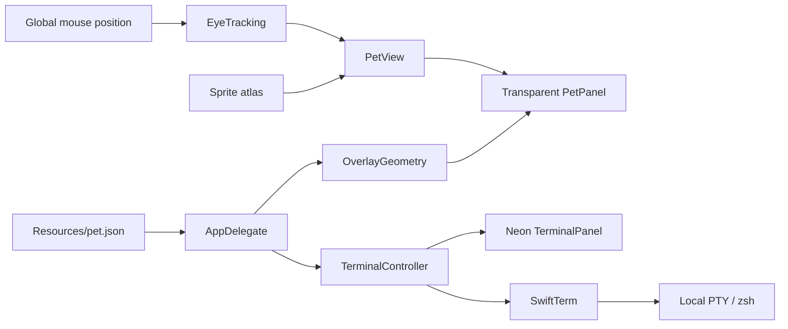

# Architecture

Pet Terminal is an AppKit accessory app with a menu-bar item, floating pet and terminal windows, and a small voice-control panel that appears beside the pet on hover. It uses the system's local zsh through SwiftTerm's pseudoterminal implementation.

| File | Responsibility |
| --- | --- |
| `Sources/App.swift` | Startup, menu, 30 Hz update loop, roaming targets, window coordination, preferences, display/sleep events, owned-shell shutdown. |
| `Sources/PetDefinition.swift` | Validated JSON settings, pet identity, gaze modes, and RGBA colors. |
| `Sources/PetView.swift` | Atlas loading, animation, pointer conversion, dragging, rendering, and alpha-aware hit testing. |
| `Sources/EyeTracking.swift` | Sixteen-direction selection, neutral zone, hysteresis, and the sample's visor mapping. |
| `Sources/Geometry.swift` | Visible-screen layout, clamping, attached-terminal placement, bounded movement steps. |
| `Sources/TerminalPanel.swift` | Native terminal view, terminal-output clipboard policy, transparent neon chrome, resize/pin/folder controls, process lifecycle. |
| `Sources/PetVoiceControls.swift` | Hover visibility, reachable microphone/stop controls, and placement beside the sprite. |
| `Sources/DictationController.swift` | On-device microphone transcription, temporary audio, live transcript revisions, cancellation, and finalized-text delivery. |
| `Tests/DesktopTests.swift` | Native behavior and PTY checks. |

## Update loop

The app samples `NSEvent.mouseLocation` on the existing 30 Hz timer. It moves the pet when roaming is enabled and the user is not interacting with the pet or terminal. It updates animation and then gaze, so eyes keep responding when roaming pauses. Hidden pets and system sleep skip visible updates. There is no screen capture or global keyboard-event listener.

Hit testing follows sprite alpha. In `directional` mode it uses the selected look frame's silhouette. In `visor` mode the compositor preserves the original alpha. Gaze textures are cached with a 64-entry limit.

The independent nonactivating voice panel preserves sprite geometry and alpha-aware hit testing. A short hover grace period keeps its button reachable; voice interaction pauses roaming. On supported macOS 26 systems, AVAudioEngine supplies temporary audio to SpeechAnalyzer. Provisional words stay in a preview; finalized text passes through SwiftTerm's input delegate without an implicit Return. A session/foreground-process check prevents delayed recognition from inserting into a changed destination. See [dictation details](DICTATION.md).

## Terminal lifecycle

The terminal is an actual PTY with a clean `zsh -f` shell. The app passes through the launch environment after stripping test and dynamic-loader injection variables, prepends standard Homebrew paths, and sets terminal metadata and a slug-based prompt. It does not persist a transcript.

`TerminalOutputPolicy` sits between the terminal parser and the local-process delegate. It denies OSC 52 clipboard queries and writes, while forwarding PTY input, resizing, title/directory updates, and other normal delegate events. User-initiated native Copy/Paste remains separate. Terminal hyperlinks open only after the user activates them; inspect their destination before opening links from untrusted output.

Hiding a window leaves the PTY alive. Selecting another directory asks before replacing the current shell. App shutdown signals only its owned shell session and foreground process group, then reaps the shell. Keep those ownership checks when extending process handling.

The terminal background is drawn by the window chrome. The terminal's default background and Metal backing remain transparent, so a configured alpha is applied once. Programs' explicit ANSI styling is separate from the default theme.

## State and identity

The default bundle identifier is `com.bexai.petterminal`; macOS UserDefaults uses it for window geometry, movement preferences, and the chosen working directory. These files stay on the user's Mac and are not included in the repo or packages. A second instance with the same bundle identifier exits to avoid duplicate companions.

Pet display names are runtime settings. Product/module names and the bundle identifier are build settings. Change the bundle identifier when you want multiple separately installed pets with independent preferences.

## Dependencies

`Vendor/SwiftTerm` is a library-only snapshot of upstream v1.20.0, commit `5d14406844143538cd8f8851d2d8a67c1fe443e5`. The local package keeps the Swift sources and Metal shader. It omits unrelated executable targets and the upstream build-metadata plugin; static build metadata records the source revision. No package download or plugin approval is needed for a normal build.
